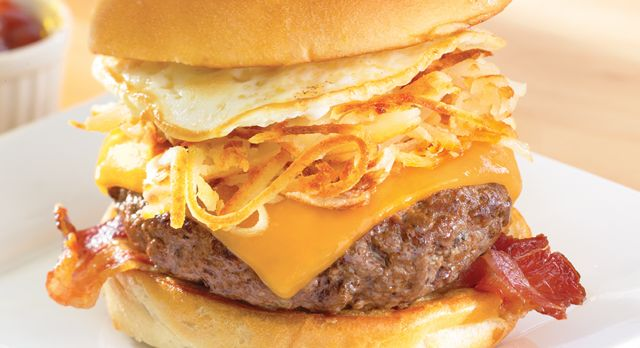

# Recipe
Teaching anyone how to make a brunch burger
The Brunch Burger

Prep: 15 min
Cook: 10-15 min
Total: 25-30 min
Servings: 1 Serving
Total Cost: 

Ingrediants

Ground turkey (https://www.instacart.com/shopping/products/2758206-shady-brook-farms-ground-turkey-1.3-lb?rid=495&utm_source=instacart_google&utm_medium=sem_shopping&utm_campaign=ad_demand_prospecting_shopping&ko_click_id=EAIaIQobChMI_7bC5ZLx5AIVh5yzCh2TrgLTEAkYAiABEgJc7fD_BwE&utm_source=instacart_google&utm_medium=paid_search_nonbrand&utm_campaign=ad_demand_shopping_food_ma_boston_newengen?ko_click_id=EAIaIQobChMI_7bC5ZLx5AIVh5yzCh2TrgLTEAkYAiABEgJc7fD_BwE&utm_medium=paid_search&utm_source=instacart_google&utm_campaign=ad_demand_prospecting&utm_term=&gclid=EAIaIQobChMI_7bC5ZLx5AIVh5yzCh2TrgLTEAkYAiABEgJc7fD_BwE) price $4.95
Butter (https://grocery.walmart.com/ip/Land-O-Lakes-Half-Stick-Salted-Butter-8-oz/10801754?wmlspartner=wlpa&selectedSellerId=0&wl13=2122&adid=22222222420331748883&wmlspartner=wmtlabs&wl0=&wl1=g&wl2=c&wl3=305074695115&wl4=pla-546274454136&wl5=9002030&wl6=&wl7=&wl8=&wl9=pla&wl10=120643079&wl11=local&wl12=10801754&wl13=2122&veh=sem_LIA&gclid=EAIaIQobChMI9_7gkpPx5AIVDRgMCh0BhwDREAkYASABEgLX1fD_BwE&gclsrc=aw.ds) price $2.79
1 Slice Cheese (https://www.target.com/p/kraft-singles-american-cheese-slices-16ct/-/A-12955140?ref=tgt_adv_XS000000&AFID=google_pla_df&fndsrc=tgtao&CPNG=PLA_Grocery%2BShopping_Local&adgroup=SC_Grocery&LID=700000001170770pgs&network=g&device=c&location=9002030&ds_rl=1246978&ds_rl=1247077&ds_rl=1246978&gclid=EAIaIQobChMI2_y8g5Hx5AIVAZyzCh0iRgj8EAkYASABEgIIDPD_BwE&gclsrc=aw.ds) price $3.19
1 Egg (https://www.target.com/p/grade-a-large-eggs-12ct-good-38-gather-8482/-/A-14713534?ref=tgt_adv_XS000000&AFID=google_pla_df&fndsrc=tgtao&CPNG=PLA_Grocery%2BShopping_Local&adgroup=SC_Grocery&LID=700000001170770pgs&network=g&device=c&location=9002030&ds_rl=1246978&ds_rl=1247077&ds_rl=1246978&gclid=EAIaIQobChMIlPuBz5Hx5AIVDVYMCh36ZAOFEAkYAiABEgIXF_D_BwE&gclsrc=aw.ds) price $0.95
1 Hashbrown (https://www.target.com/p/hash-brown-frozen-patties-10ct-market-pantry-153/-/A-14759240?ref=tgt_adv_XS000000&AFID=google_pla_df&fndsrc=tgtao&CPNG=PLA_Grocery%2BShopping_Local&adgroup=SC_Grocery&LID=700000001170770pgs&network=g&device=c&location=9002030&gclid=EAIaIQobChMI2LHYsZLx5AIVUuDICh27WAWhEAkYAyABEgKSOfD_BwE&gclsrc=aw.ds) price $2.39
Hamburger Buns

Steps
Mold ground turkey into a patty
Place patty onto pan
than crack egg onto another pan to fry
Put the hashbrown into a oven to cook 
(Optional) Toast the buns

Assembling The Brunch Burger
1. Grab the bottom bun 
2. Place the patty on the bun
3. Place a slice of cheese
4. Place the Hashbrown
5. Place the fried egg 
6. Place The Top bun
